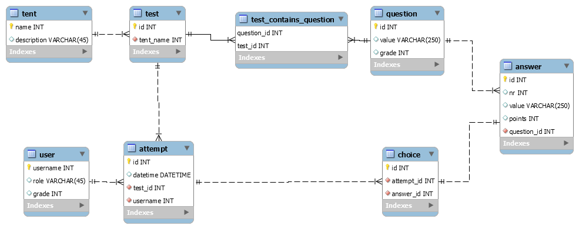

# Documentatie

**Systeem dat leerlingen beoordeelt aan de hand van testen**

Rollen: leerling (graad, klas), admin, leerkracht

Objecten: test, tent (compeTENTie, tijdelijk hardcoded), vraag, resultaat

test bevat tenten bevat (meerkeuze)vragen
test afleggen -> resultaat

verschillende vragen per graad

mieke.kemme@ucll.be

## Databasemodel

* Een *tent* (competentie) bevat minstens één of meerdere *testen*
* Een *test* bevat minstens één of meerdere *vragen*. Een vraag kan in meerdere testen (van dezelfde tent) voorkomen.
* Een *vraag* heeft minstens één of meerdere *antwoorden* (waarvan één correct)
* Een *gebruiker* heeft minstens één of meerdere pogingen om een *test* te nemen
* Een *poging* heeft meerdere keuzes, één per *vraag*
* Elke *keuze* verwijst naar één bepaalde *vraag*

## Objecten

1. Test
2. Tent
3. Vraag
4. Resultaat

## Rollen

1. Leerling
    * Kan test afleggen (formulier met lijst vragen met elke een select met alle mogelijke antwoorden)
    * Kan resultaat test zien
    * Kan overzicht tenten zien

2. Admin
    * Kan gebruikers beheren
    * Kan leerkracht/leerling beheren
    * Kan tenten beheren/toevoegen
    * Kan vragen beheren/toevoegen
    * Kan vraag wijzigen/verwijderen

3. Leerkracht
    * Kan resultaten raadplegen van eigen klas